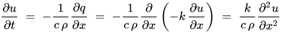

# Hardware Accelerated Finite Element Analysis

Finite Element Analysis is a foundational tool for many engineers. Traditionally, if an engineer wants to do a calculation on the maximum amount of stress, strain, heat flux, etc. in a material or object, they would need to make simplifying assumptions until the object became amenable to hand calculations. Finite Element Analysis is a computational techniqe that allows analysis of parts with complex geometries, without any simplifying assumptions needing to be made. Engineers can design arbitrarily complex parts or systems, and be guaranteed that analysis is possible. 

This technique gave rise to the concept of generative design. Generative design is based on repeated application of FEA. A part is described by a set of constraints instead of definite geometry. Analysis is then performed on a block of material that fulfills the spacial constraints, and then material that isn't necessary for the load constraints is removed iteratively. Generative design has the potential to automate much of the engineering process. One significant downside is the amount of time it takes to perform FEA on a part. One part can take anywhere from 1 minute to several hours to analyze properly depending on precision needs.

Our goal is to perform analysis on a part in a few hundred or thousand clock cycles, rather than minutes or hours. We want to make the primary bottleneck of FEA the meshing process, so that generative algorithms can complete in seconds rather than hours. To do this we designed a system to perform FEA using an application specific integrated circuit (ASIC). We designed a system to solve the one dimensional heat equation, and a scheme to generalize our solution to three dimensions, and other types of differential equations. 

## Architectural Description

*An example of a 3 dimensional mesh at various resolutions. Note that the mesh consists of nodes (the dots) connected by edges (the lines).*

FEA generally operates on a mesh of the part. A mesh is typically generated from a more precise description of part in order to make a discrete approximation so that analysis on a large but *finite* number of elements can be performed (hence the name Finite Element Analysis). This mesh can be one, two or three dimensional depending on the type of problem being analyzed. A mesh consists of a series of nodes with edges in between them designating connections to other nodes. Most algorithms comprise of applying some function on each node which is dependent on the values of the surrounding nodes (nodes which are connected by edges) and it's own value, and maybe some number of derivatives (i.e. the change in surrounding nodes values, or change in it's own value). These functions are typically very simple and linear, meaning they approximate the solution to a differential equation in a similar way to Eulers's method, using many linear approximations with small time steps.

In order to emulate this technique in hardware, our architecture is based on a series of nodes as well which perform these computations. Each node is capable of connecting to other nodes through a technique we will describe later, and thus simulate any mesh connection. 

### 1 Dimensional Architecture

We will be starting with solving the 1 dimensional heat equation. The heat equation is a partial differential equation defined by:

In order to approximate a solution to this equation, we need to discretize it. This entails taking the linear terms of the Taylor series around T[t,j]. The discretization is the following:

Note that each T[t,j] relies on the nodes to the left, T[t,j-1], and right, T[t,j+1], as well as the node value itself. Our nodes implemented in hardware contain registers which model the node's internal temperature and current position. Each node is connected to nodes to the left and right of itself (since there is one dimension) except for the two end point nodes. The nodes share positions as well as their internal values, which allows each to calculate *dx* as well as the change in temperature. 

*The layout of our 1 dimensional nodes, connected togeather sharing information between them.*

We were able to successfuly simulate the 1 dimensional heat equation in verilog using this architecture. To compile, run and plot the simulation simply run `nodes_sol.sh` from the `/Nodes` directory. This should produce an animation similar to the following:

Unfortunately, one problem with this architecture is that it does not scale well. Imagine we have a two dimsensional mesh we would like to simulate. Each node might be connected to 3, 4, 5, or even 6 other nodes. The one dimensional architecture described has a fixed connection architecture, so it obviously wouldn't be able to generalize to these other cases. In order to generalize to solving more arbitrary meshes, we will describe a new architecture which we didn't implement yet but should allow for the scaling properties mentioned. 

### Multi-Dimensional Architecture

Since most siliocn processes are two dimensional (except for new "three dimensional" architectures which are in reality just layered planes with vias), then the best layout of nodes we can hope to achieve is a 2 dimensional grid. The question then becomes how we connect the nodes togeather in order to simulate any arbitrary 1, 2 or 3 dimensional mesh. There are many architectures to consider, most of which have serious scaling problems. For example, we might connect every node to every other node (a complete graph), and signal in a register which ones they're connected to. Unfortunately, this scales poorly as a 12 node network has 66 connections. Another way we could connect nodes is similar to the connection fabric of an FPGA. This typically involves connecting "blocks" by using separate router blocks permanently per upload. Unfortunately, we may need to connect a node to more than 4 other nodes, so this becomes a problem since each block can be connected to at most the 4 locations. 

*Connection fabric of an FPGA. Credit [Clive Maxfield](https://www.embedded.com/the-mcu-guys-introduction-to-fpgas-the-hardware/)*

For the purpose FPGA's are designe for, this limitation is not an issue. There isn't a particular dimensionality to most logic described by verilog, and no particular preferance for one connection method over another. Now that we see some of the issues, we will describe our solution to these problems. 

We will assume that for most 3D meshes, which are the highest dimensional mesh we need to account for, the maximum vertex degree is relatively  low, i.e. maybe 10 or 12. We will also assume that the maximum degree of a vertex can also be lowered by mesh optimization processes. With this in mind, we propose a grid of nodes where each node can either be a wire (pass a signal through) or be a connection. By allowing for several time steps to progress in this manner, each node can connect to an arbitrary number of nodes by having it's connection routed through other nodes if necessary. Here is a truncated depiction of the connection network:

*Proposed connection fabric, which each node connected to the four surrounding nodes.*

Additional registers are now needed for this new architecture. Notice that there is a Tnext, PassThroughDes, Py, and Pz. The Py and Pz are there to extend the problem to three dimensions. The Tnext is necessary since each time step will now take multiple clock cycles, and since the next value of each node depends on the current value of the node and surrounding nodes, then the next value needs to be stored indepenently of the current value. 

*The nodes can then be connected through other nodes.*

Now that we see that nodes can be connected through other nodes, let's discuss the method in which this is executed in order to map 3 dimensional meshes to this 2 dimensional grid network. Each node has what is called a Pass Through Destination register, PassThroughDes, which descibes it's connection behavior. This register contains several instructions per node, which are executed sequentially. Each instruction tells the node how to pass data through it, or how to connect to it's surrounding nodes. 

*Labels for each nodes, describing the directions of connections.*

| Binary String  | Command Description |
| --- | --- |
| 0000 | Idle |
| 0001 | 1<->2 |
| 0010 | 2<->3 |
| 0011 | 3<->4 |
| 0100 | 4<->1 |
| 0101 | 1<->3 |
| 0110 | 2<->4 |
| 0111 | Conn_1 |
| 1000 | Conn_2 |
| 1001 | Conn_3 |
| 1010 | Conn_4 |

The command `0001` denoted by `1<->2` describes passing the information from the node in position 1 to the node in position 2 and vice versa. The command `0111` connects the node to whatever information is present in the position 1. Each PassThroughDes register contains some number of instructions, which depends on the maximum degree of graph expected from whatever mesh is being mapped to the grid. For example, a high maximum degree will require many clock cycles and connection cycles to connect the vertex of maximum degree. The tradeoff is the more instructions that PassThroughDes contains, the longer each iteration of analysis takes. We estimate around 10 or 12 instructions should be necessary, but this should be investigated by data on meshes across various meshing algorithms. 

*Example of a node connection through another node. The upper left node is commanded `Conn_3` which connects it to the node beneath it. The bottom left node is commanded `1<->2` which passes through the sigals of the right and top nodes. The bottom right node is commanded `Conn_4` which connects it to the node to the left of it. Thus the data from the upper left and lower right nodes are shared.*

We see above how a pair of nodes might be connected based on the scheme described (see caption). Each node goes in sequence through connections as described in the PassThroughDes register. Each time a connection is made, the node adds the effect of the connected node to the Tnext register, which is possible since the computation is linear by defintion. 

*Node timing diagram as the PassThroughDes register is iterated through. At the end, the cycle repeats and the Tnext becomes Tcurr*

